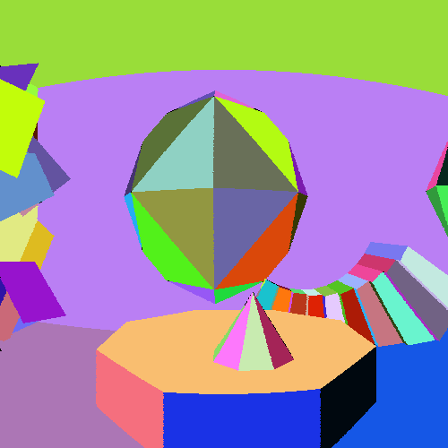
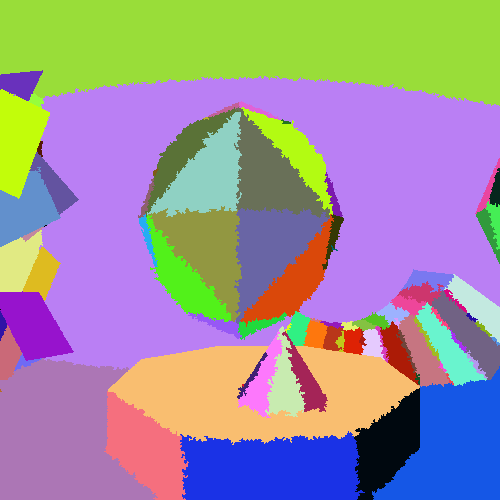
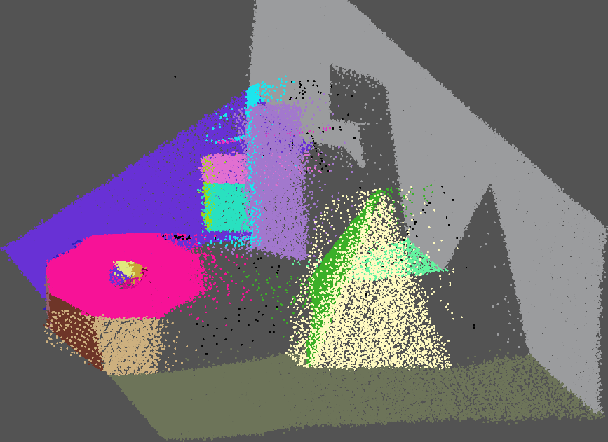

# PPE: Probabilistic Plane Extraction

 | 
--|--
Ground-truth segmentation of a SynPEB scan | Corresponding PPE segmentation

This repository contains the implementation of the plane extraction algorithm presented in the following paper:

[Alexander Schaefer, Johan Vertens, Daniel Büscher, Wolfram Burgard: 
**A Maximum Likelihood Approach to Extract Finite Planes from 3-D Laser Scans.** 
*Proceedings of the IEEE International Conference on Robotics and Automation, Montreal, Canada, May 2019.*](http://ais.informatik.uni-freiburg.de/publications/papers/schaefer19icra.pdf) 
[[BibTeX]](http://www2.informatik.uni-freiburg.de/~aschaef/bib/schaefer19icra.bib)

This plane extraction algorithm takes an organized 3-D point cloud as input and outputs a set of planes that approximate the geometry underlying the point cloud.

## How to extract planes

To extract planes from an organized point cloud, use the function [`pcextrpln`](./matlab/pcextrpln.m).
For details about how to use [`pcextrpln`](./matlab/pcextrpln.m), please refer to the detailed documentation in the function header.

## [The synthetic plane extraction benchmark](http://synpeb.cs.uni-freiburg.de/)

While testing our plane extraction algorithm and comparing it to other methods, we found out that the well established SegComp dataset exhibits several deficiencies, which are described in our paper.
In order to create a new strong baseline, we created the synthetic plane extraction benchmark: SynPEB.
The SynPEB dataset can be downloaded at [http://synpeb.cs.uni-freiburg.de/](http://synpeb.cs.uni-freiburg.de/).

 
Side view of the ground-truth segmentation of a SegComp scan

## How to repeat our experiments

To verify our experimental results, please download SegComp and SynPEB.
Then, navigate to the `matlab/experiments` folder.
By running the script [`runexp.m`](./matlab/experiments/runexp.m), you perform the experiments.
To trigger the automatic evaluation of the data generated during the experiments, please start the script [`evalexp.m`](./matlab/experiments/evalexp.m).
The script [`ploteval.m`](./matlab/experiments/ploteval.m) finally visualizes the evaluation results.

In order to accelerate the plane extraction process, it is recommended to compile the CUDA code in the `gpufit` folder.
For instructions, see the corresponding [readme file](./gpufit/README.md).
